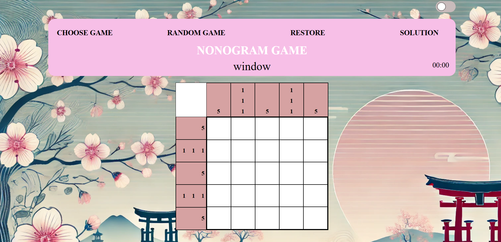

# Nonograms game

## Deploy: [link](https://vlaru.github.io/RSS_stage1-2/nonograms/)
## Task 
implement a classic game — [Nonogram](https://en.wikipedia.org/wiki/Nonogram)  
## Stack 
- JS
- HTML
- CSS / SCSS
- Prettier
- Linter
- Webpack
## Features
### The main feature of project is that it works entirely with the DOM, generating all page elements using vanilla JS
- all necessary elements are generated using JS, body is empthy
- adaptive and responsive design.
- a player is able to fill in a cell in the grid (changing the color dark), using left mouse-click.
- when player clicks on dark cell - it will change to empty (white).
- a player is able to fill in a cell in the grid changing the color of the grid to crossed-cell(X) using right mouse-click. Context menu should not appear.
- end game when players fill all **black** cells correctly according to the clues. On a successful game solution, display "Great! You have solved the nonogram!"
- players should be able to choose the picture they wish to solve, possibly through a list of items.
- the game can be restarted (reset) without reloading the page (by clicking on button `Reset game`).
- the player can change game template or game level with options without reloading the page.
- display the game duration in format XX:XX, stop-watch will start after first click on field (not on clues). "Great! You have solved the nonogram in ## seconds!" is displayed after winning.
- dark/light themes of the game.
- implement three levels of difficulty in the game: easy (5x5), medium (10x10), and hard (15x15).
- implement button "random game". When player clicks on button - the random template appears.
- implement "Solution" button near the field. When player clicks the button - the field will be filled in cells with right solution.

